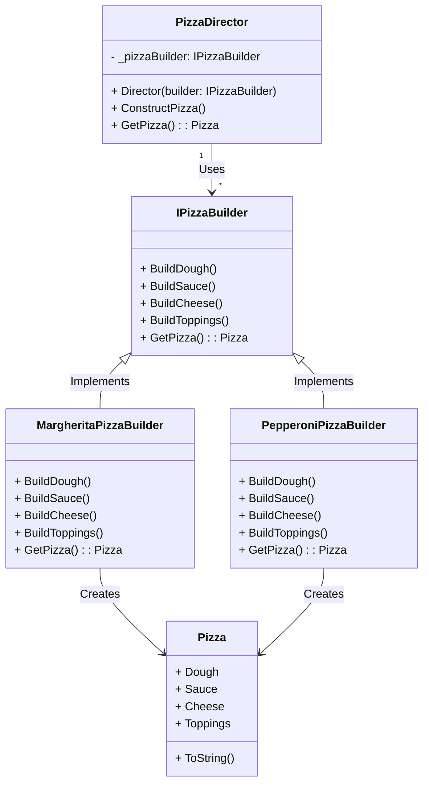
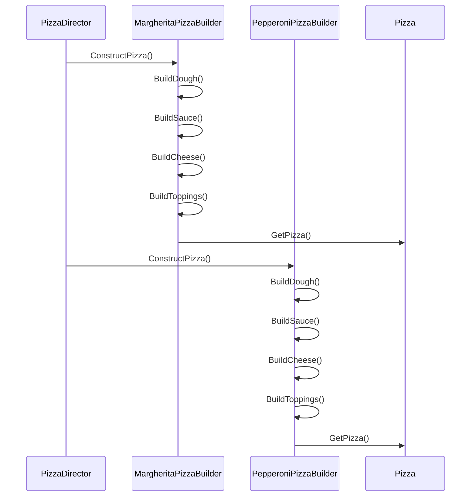
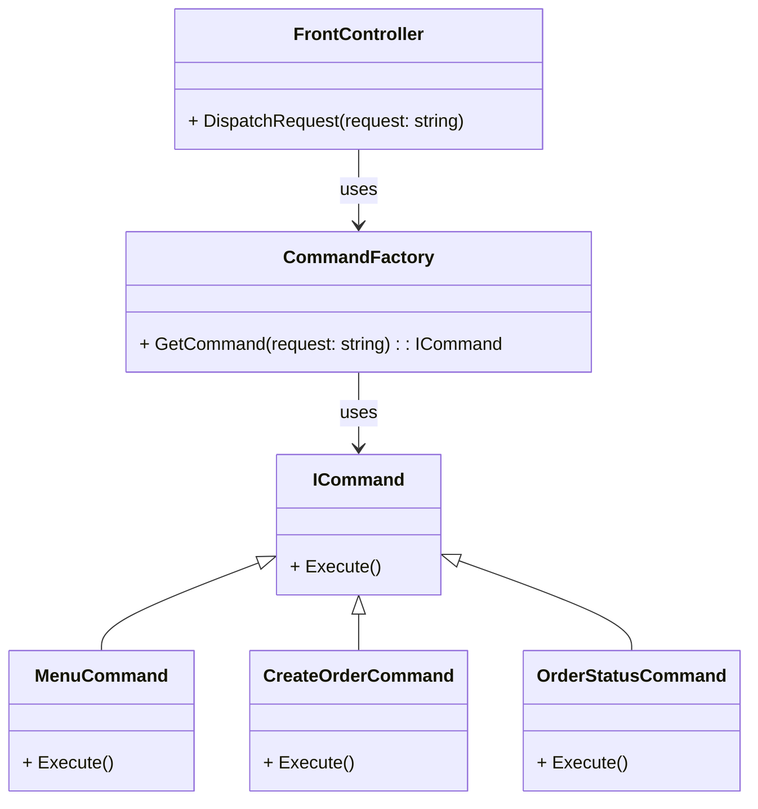
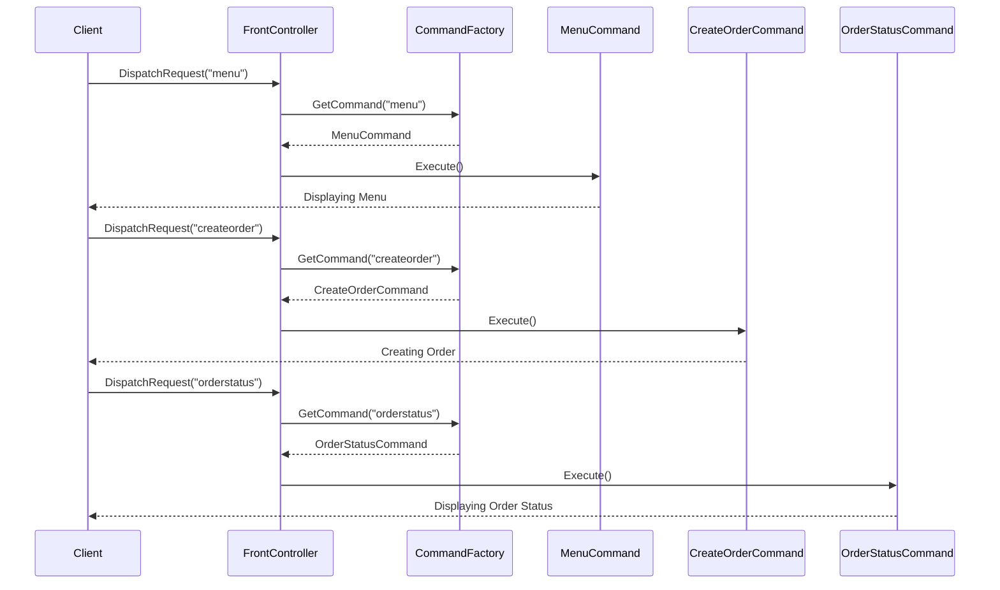
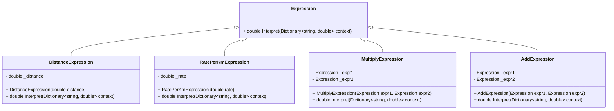
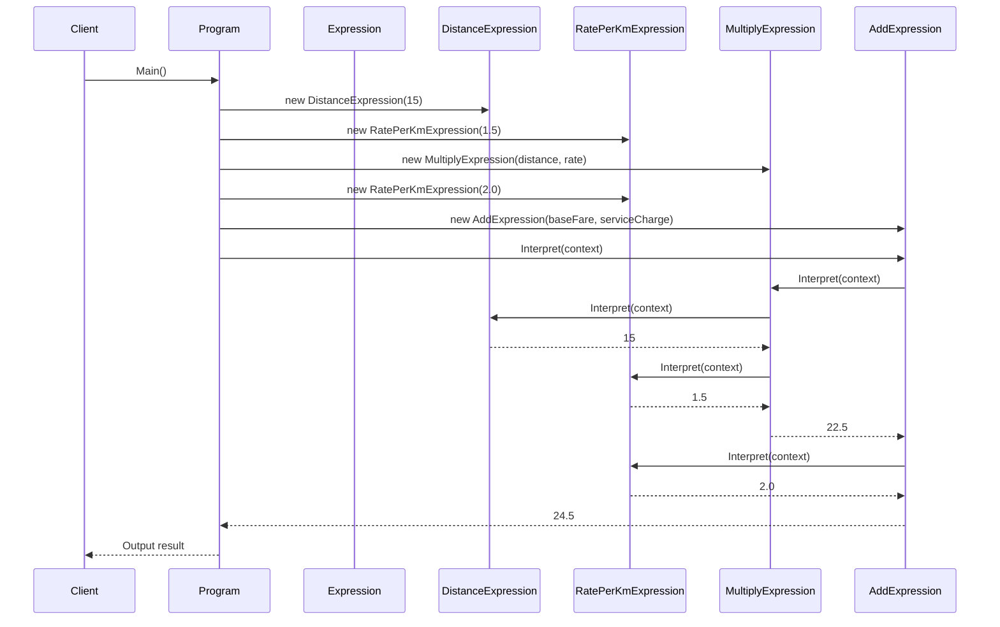
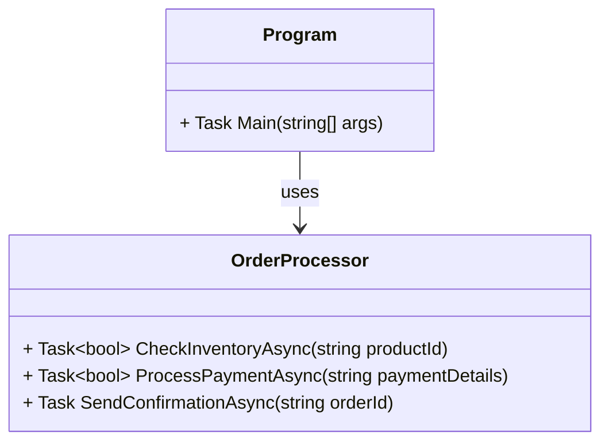
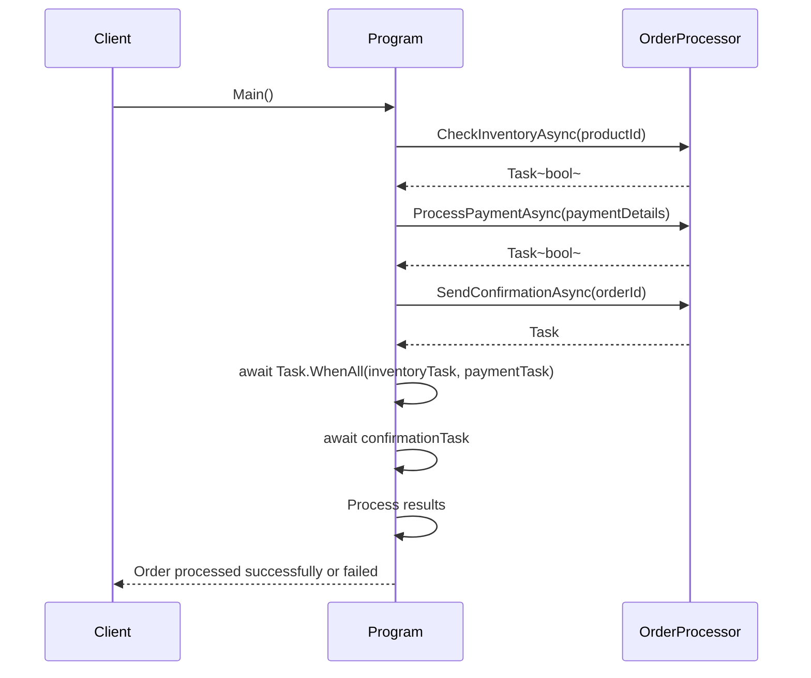

# Розрахунково-графічна робота «Шаблони проектування»

# Builder

Шаблон проектування Builder — це один із шаблонів проектування, який описує, як вирішити повторювані проблеми проектування в об’єктно-орієнтованому програмному забезпеченні.

**Шаблон проектування Builder вирішує такі проблеми, як:**

- Як клас (той самий процес конструювання) може створювати різні представлення складного об’єкта?
- Як можна спростити клас, який включає створення складного об’єкта?
- Створення та збирання частин складного об’єкта безпосередньо в класі є негнучким. Це зобов’язує клас створити певне представлення складного об’єкта та унеможливлює зміну представлення пізніше незалежно від класу (без необхідності змінювати).

**Шаблон проектування Builder описує, як вирішити такі проблеми:**

- Інкапсулюйте створення та збирання частин складного об’єкта в окремий Builderоб’єкт.
- Клас делегує створення об’єкта об’єкту Builderзамість того, щоб створювати об’єкти безпосередньо.
- Клас (той самий процес конструювання) може делегувати різні Builderоб’єкти для створення різних представлень складного об’єкта.

**Мета**
  
Метою шаблону проектування Builder є відокремлення конструкції складного об’єкта від його представлення. Таким чином, той самий процес побудови може створювати різні уявлення.

**Переваги**

Переваги шаблону Builder включають:

- Дозволяє варіювати внутрішнє представлення продукту.
- Інкапсулює код для побудови та представлення.
- Здійснює контроль за етапами будівельного процесу.

**Недоліки**

Недоліки шаблону Builder включають:

- Для кожного типу продукту необхідно створити окремий ConcreteBuilder.
- Класи конструктора мають бути змінними.
- Може перешкоджати/ускладнювати ін’єкцію залежності.

**Статична модель (діаграма класів та/або діаграма модулів)**

    
**Динамічна модель (діаграма взаємодії та/або стану)**

# Front Controller

Front Controller (фронт-контролер, єдина точка входу) - шаблон проєктування, який є спеціалізованою варіацією шаблону проєктування Посередник. Задачею фронт-контролера є надання єдиної точки входу для обробки усіх запитів та виклик відповідної поведінки в залежності від запиту.

Фронт-контролер найчастіше використовується у вебзастосунках, де є багато подібних речей, які потрібно виконати при обробці запиту. Це може бути безпека, інтернаціоналізація, забезпечення певного вигляду для певних користувачів. Якщо обробка вхідних запитів розподілена між кількома контролерами це може призвести до дублювання поведінки. Крім того виникають складності зі зміною поведінки під час виконання. Фронт-контролер об'єднує обробку запитів шляхом їх направлення через єдиний об'єкт-обробник. Цей об'єкт реалізовує загальну поведінку, яка може бути змінена під час виконання за допомогою декораторів. Після цього Front controller створює потрібні об'єкти відповідно до запиту та викликає методи для реалізації конкретної задачі.

**Статична модель (діаграма класів та/або діаграма модулів)**

**Динамічна модель (діаграма взаємодії та/або стану)**

# Interpreter

Шаблон проектування Interpreter належить до категорії поведінкових шаблонів проектування. Він надає механізм для інтерпретації та оцінки мовних виразів шляхом визначення граматики та інтерпретатора. Патерн представляє елементи мови як класи та використовує рекурсивні алгоритми для оцінки виразів. Це сприяє розширюваності та дозволяє додавати нові правила граматики або мовні конструкції.

**Ключові особливості шаблону проектування інтерпретатора:**
- Абстрактний вираз : клас абстрактного виразу визначає абстрактний інтерфейс для виразів мови. Він оголошує interpret()метод, який визначає логіку інтерпретації для виразів.
- Термінальні вирази: класи термінальних виразів представляють елементарні будівельні блоки мови. Вони реалізують інтерфейс абстрактного виразу та забезпечують логіку інтерпретації для термінальних виразів.
- Нетермінальні вирази: класи нетермінальних виразів представляють складені вирази, що складаються з кількох підвиразів. Вони також реалізують інтерфейс абстрактного виразу та забезпечують логіку інтерпретації для складених виразів.
- Контекст: клас контексту надає будь-яку необхідну інформацію або стан, необхідні для інтерпретації виразів. Він зберігає глобальну інформацію, яку спільно використовують вирази під час інтерпретації.

**Переваги шаблону проектування інтерпретатора:**
- Розширюваність : шаблон Інтерпретатор дозволяє додавати нові граматичні правила або мовні конструкції шляхом створення нових класів виразів. Це робить його гнучким і розширюваним для розміщення нових функцій мови.
- Розділення проблем: шаблон відокремлює логіку інтерпретації від мовних виразів. Кожен клас виразів зосереджується на інтерпретації свого конкретного граматичного правила, сприяючи модульності коду та зручності обслуговування.
- Спрощене представлення граматики: шаблон Інтерпретатор забезпечує чіткий і стислий спосіб представлення складних граматик за допомогою об’єктно-орієнтованих класів і рекурсивних алгоритмів.
- Легко реалізувати нові інтерпретатори: шаблон забезпечує структурований підхід для створення інтерпретаторів для різних мов або предметно-спеціальних мов (DSL).

**Статична модель (діаграма класів та/або діаграма модулів)**

**Динамічна модель (діаграма взаємодії та/або стану)**

# Asynchronous method invocation

AMI — це шаблон проектування для асинхронного виклику потенційно довготривалих методів об’єкта . [1] Це еквівалент моделі IOU («я вам у боргу»), описаної в 1996 році Алланом Вермюленом. [2] [3]

У більшості мов програмування викликаний метод виконується синхронно, тобто в потоці виконання , з якого він викликається. Якщо виконання методу займає багато часу, наприклад через те, що він завантажує дані через Інтернет, викликаючий потік блокується, доки метод не завершиться. Якщо це небажано, можна запустити «робочий потік» і викликати метод звідти. У більшості середовищ програмування це вимагає багато рядків коду, особливо якщо вжити заходів, щоб уникнути накладних витрат, які можуть бути викликані створенням багатьох потоків. AMI вирішує цю проблему тим, що він доповнює потенційно довготривалий ("синхронний") метод об'єкта "асинхронним" варіантом, який повертає негайно, разом із додатковими методами, які полегшують отримання сповіщень про завершення або очікування завершення на пізніше.

Одним із поширених застосувань AMI є шаблон проектування активного об’єкта . Альтернативами є синхронний виклик методу та майбутні об'єкти . [4] Прикладом програми, яка може використовувати AMI, є веб-браузер, якому необхідно відобразити веб-сторінку ще до завантаження всіх зображень.

Оскільки метод є окремим випадком процедури , асинхронний виклик методу є окремим випадком виклику асинхронної процедури .

**Статична модель (діаграма класів та/або діаграма модулів)**

**Динамічна модель (діаграма взаємодії та/або стану)**

